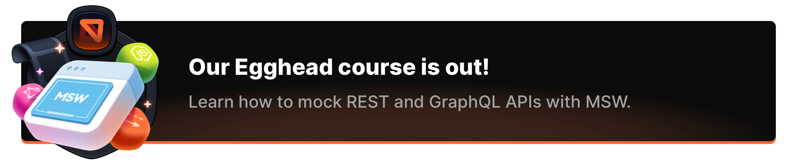

> **MSW 2.0 is finally here! 🎉** Read the [Release notes](https://github.com/mswjs/msw/releases/tag/v2.0.0) and please follow the [**Migration guidelines**](https://mswjs.io/docs/migrations/1.x-to-2.x) to upgrade. If you're having any questions while upgrading, please reach out in our [Discord server](https://kettanaito.com/discord).
>
> We've also recorded the most comprehensive introduction to MSW ever. Learn how to mock APIs like a pro in our official video course:

<a href="https://egghead.io/courses/mock-rest-and-graphql-apis-with-mock-service-worker-8d471ece?af=8mci9b" target="_blank">
  
</a>

<br />
<br />

<p align="center">
  
</p>

<h1 align="center">Mock Service Worker</h1>
<p align="center">Mock Service Worker (MSW) is a seamless REST/GraphQL API mocking library for browser and Node.js.</p>

<p align="center">
  <a href="https://www.npmjs.com/package/msw" target="_blank"></a>
  <a href="https://www.npmjs.com/package/msw" target="_blank"></a>
   <a href="https://kettanaito.com/discord" target="_blank"></a>
</p>

<br />

<br />

## Features

- **Seamless**. A dedicated layer of requests interception at your disposal. Keep your application's code and tests unaware of whether something is mocked or not.
- **Deviation-free**. Request the same production resources and test the actual behavior of your app. Augment an existing API, or design it as you go when there is none.
- **Familiar & Powerful**. Use [Express](https://github.com/expressjs/express)-like routing syntax to intercept requests. Use parameters, wildcards, and regular expressions to match requests, and respond with necessary status codes, headers, cookies, delays, or completely custom resolvers.

---

> "_I found MSW and was thrilled that not only could I still see the mocked responses in my DevTools, but that the mocks didn't have to be written in a Service Worker and could instead live alongside the rest of my app. This made it silly easy to adopt. The fact that I can use it for testing as well makes MSW a huge productivity booster._"
>
> – [Kent C. Dodds](https://twitter.com/kentcdodds)

## Documentation

This README will give you a brief overview on the library but there's no better place to start with Mock Service Worker than its official documentation.

- [Documentation](https://mswjs.io/docs)
- [**Getting started**](https://mswjs.io/docs/getting-started)
- [FAQ](https://mswjs.io/docs/faq)

## Examples

- See the list of [**Usage examples**](https://github.com/mswjs/examples)

## Browser

- [Learn more about using MSW in a browser](https://mswjs.io/docs/integrations/browser)
- [`setupWorker` API](https://mswjs.io/docs/api/setup-worker)

### How does it work?

In-browser usage is what sets Mock Service Worker apart from other tools. Utilizing the [Service Worker API](https://developer.mozilla.org/en-US/docs/Web/API/Service_Worker_API), which can intercept requests for the purpose of caching, Mock Service Worker responds to intercepted requests with your mock definition on the network level. This way your application knows nothing about the mocking.

**Take a look at this quick presentation on how Mock Service Worker functions in a browser:**

[](https://youtu.be/HcQCqboatZk)

### How is it different?

- This library intercepts requests on the network level, which means _after_ they have been performed and "left" your application. As a result, the entirety of your code runs, giving you more confidence when mocking;
- Imagine your application as a box. Every API mocking library out there opens your box and removes the part that does the request, placing a blackbox in its stead. Mock Service Worker leaves your box intact, 1-1 as it is in production. Instead, MSW lives in a separate box next to yours;
- No more stubbing of `fetch`, `axios`, `react-query`, you-name-it;
- You can reuse the same mock definition for the unit, integration, and E2E testing. Did we mention local development and debugging? Yep. All running against the same network description without the need for adapters of bloated configurations.

### Usage example

```js
// src/mocks.js
// 1. Import the library.
import { http, HttpResponse } from 'msw'
import { setupWorker } from 'msw/browser'

// 2. Describe network behavior with request handlers.
const worker = setupWorker(
  http.get('https://github.com/octocat', ({ request, params, cookies }) => {
    return HttpResponse.json(
      {
        message: 'Mocked response',
      },
      {
        status: 202,
        statusText: 'Mocked status',
      },
    )
  }),
)

// 3. Start request interception by starting the Service Worker.
await worker.start()
```

Performing a `GET https://github.com/octocat` request in your application will result into a mocked response that you can inspect in your browser's "Network" tab:


> **Tip:** Did you know that although Service Worker runs in a separate thread, your mock definition executes entirely on the client? This way you can use the same languages, like TypeScript, third-party libraries, and internal logic to create the mocks you need.

## Node.js

- [Learn more about using MSW in Node.js](https://mswjs.io/docs/integrations/node)
- [`setupServer` API](https://mswjs.io/docs/api/setup-server)

### How does it work?

There's no such thing as Service Workers in Node.js. Instead, MSW implements a [low-level interception algorithm](https://github.com/mswjs/interceptors) that can utilize the very same request handlers you have for the browser. This blends the boundary between environments, allowing you to focus on your network behaviors.

### How is it different?

- Does not stub `fetch`, `axios`, etc. As a result, your tests know _nothing_ about mocking;
- You can reuse the same request handlers for local development and debugging, as well as for testing. Truly a single source of truth for your network behavior across all environments and all tools.

### Usage example

Take a look at the example of an integration test in Vitest that uses [React Testing Library](https://github.com/testing-library/react-testing-library) and Mock Service Worker:

```js
// test/Dashboard.test.js

import React from 'react'
import { http, HttpResponse } from 'msw'
import { setupServer } from 'msw/node'
import { render, screen, waitFor } from '@testing-library/react'
import Dashboard from '../src/components/Dashboard'

const server = setupServer(
  // Describe network behavior with request handlers.
  // Tip: move the handlers into their own module and
  // import it across your browser and Node.js setups!
  http.get('/posts', ({ request, params, cookies }) => {
    return HttpResponse.json([
      {
        id: 'f8dd058f-9006-4174-8d49-e3086bc39c21',
        title: `Avoid Nesting When You're Testing`,
      },
      {
        id: '8ac96078-6434-4959-80ed-cc834e7fef61',
        title: `How I Built A Modern Website In 2021`,
      },
    ])
  }),
)

// Enable request interception.
beforeAll(() => server.listen())

// Reset handlers so that each test could alter them
// without affecting other, unrelated tests.
afterEach(() => server.resetHandlers())

// Don't forget to clean up afterwards.
afterAll(() => server.close())

it('displays the list of recent posts', async () => {
  render(<Dashboard />)

  // 🕗 Wait for the posts request to be finished.
  await waitFor(() => {
    expect(
      screen.getByLabelText('Fetching latest posts...'),
    ).not.toBeInTheDocument()
  })

  // ✅ Assert that the correct posts have loaded.
  expect(
    screen.getByRole('link', { name: /Avoid Nesting When You're Testing/ }),
  ).toBeVisible()

  expect(
    screen.getByRole('link', { name: /How I Built A Modern Website In 2021/ }),
  ).toBeVisible()
})
```

> Don't get overwhelmed! We've prepared a step-by-step [**Getting started**](https://mswjs.io/docs/getting-started) tutorial that you can follow to learn how to integrate Mock Service Worker into your project.

Despite the API being called `setupServer`, there are no actual servers involved! The name was chosen for familiarity, and the API was designed to resemble operating with an actual server.

## Sponsors

Mock Service Worker is trusted by hundreds of thousands of engineers around the globe. It's used by companies like Google, Microsoft, Spotify, Amazon, and countless others. Despite that, this library remains a hobby project maintained in spare time and has no opportunity to financially support even a single full-time contributor.

**You can change that!** Consider [sponsoring the effort](https://github.com/sponsors/mswjs) behind one of the most innovative approaches around API mocking. Raise a topic of open source sponsorships with your boss and colleagues. Let's build sustainable open source together!

### Golden Sponsors

> Become our _golden sponsor_ and get featured right here, enjoying other perks like issue prioritization and a personal consulting session with us.
>
> **Learn more on our [GitHub Sponsors profile](https://github.com/sponsors/mswjs)**.

<br />

<table>
  <tr>
    <td>
      <a href="https://www.github.com/" target="_blank">
        <picture>
          <source media="(prefers-color-scheme: dark)" srcset="media/sponsors/github-light.svg" />
          
        </picture>
      </a>
    </td>
    <td>
      <a href="https://www.codacy.com/" target="_blank">
        
      </a>
    </td>
    <td>
      <a href="https://workleap.com/" target="_blank">
        
      </a>
    </td>
    <td>
      <a href="https://www.chromatic.com/?ref=mswjs" target="_blank">
        
      </a>
    </td>
  </tr>
</table>

### Silver Sponsors

> Become our _silver sponsor_ and get your profile image and link featured right here.
>
> **Learn more on our [GitHub Sponsors profile](https://github.com/sponsors/mswjs)**.

<br />

<table>
  <tr>
    <td>
      <a href="https://www.replay.io/" target="_blank">
        
      </a>
    </td>
    <td>
      <a href="https://codemod.com/" target="_blank">
        
      </a>
    </td>
    <td>
      <a href="https://github.com/ryanmagoon" target="_blank">
        
      </a>
    </td>
  </tr>
</table>

### Bronze Sponsors

> Become our _bronze sponsor_ and get your profile image and link featured in this section.
>
> **Learn more on our [GitHub Sponsors profile](https://github.com/sponsors/mswjs)**.

<br />

<table>
  <tr>
    <td>
      <a href="https://materialize.com/" target="_blank">
        
      </a>
    </td>
    <td>
      <a href="https://trigger.dev/" target="_blank">
        
      </a>
    </td>
    <td>
      <a href="https://vital.io/" target="_blank">
        
      </a>
    </td>
  </tr>
</table>

## Awards & Mentions

We've been extremely humbled to receive awards and mentions from the community for all the innovation and reach Mock Service Worker brings to the JavaScript ecosystem.

<table>
  <tr valign="middle">
    <td width="124">
      
    </td>
    <td>
      <h4>Solution Worth Pursuing</h4>
      <p><em><a href="https://www.thoughtworks.com/radar/languages-and-frameworks/mock-service-worker">Technology Radar</a> (2020–2021)</em></p>
    </td>
  </tr>
  <tr>
    <td width="124">
      
    </td>
    <td>
      <h4>The Most Exciting Use of Technology</h4>
      <p><em><a href="https://osawards.com/javascript/2020">Open Source Awards</a> (2020)</em></p>
    </td>
  </tr>
</table>
