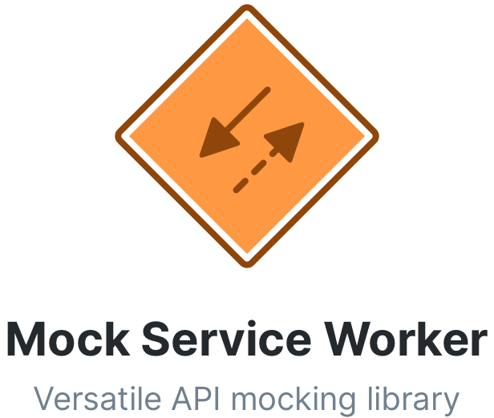

<p align="center">
  
</p>

<p align="center">
  <a href="https://www.npmjs.com/package/msw" target="_blank">
    
  </a>
  <a href="https://circleci.com/gh/mswjs/msw" target="_blank">
    
  </a>
  <a href="https://david-dm.org/mswjs/msw" target="_blank">
    
  </a>
  <a href="https://david-dm.org/mswjs/msw?type=dev" target="_blank">
    
  </a>
</p>

<p align="center">Mock Service Worker (MSW) is an API mocking library for browser and Node that intercepts outgoing requests using Service Workers.</p>

## Features

- **Server-less**. Mocking that doesn't establish any servers, operating entirely in a browser;
- **Seamless**. Forget about stubs and hacks that make your code smell. Leverage a dedicated layer of interception to keep your code clean and shiny.
- **Deviation-free**. Request _the same_ resources you would in production, and mock their responses. No more conditional URLs, no more mock-specific parts of code in your app.
- **Mocking as a tool**. Enable, change, disable mocking on runtime _instantly_ without any compilations or rebuilds. Control the MSW lifecycle from your browser's DevTools;
- **Essentials**. Use [Express](https://github.com/expressjs/express/)-like syntax to define which requests to mock. Respond with custom status codes, headers, delays, or create custom response resolvers.

> "This is awesome."
>
> – [Kent C. Dodds](https://twitter.com/kentcdodds/status/1233899811608219648)

## Documentation

- [Documentation](https://redd.gitbook.io/msw)
- [**Getting started**](https://redd.gitbook.io/msw/getting-started)
- [Recipes](https://redd.gitbook.io/msw/recipes)

## Quick start

Install the library in your project:

```bash
$ npm install msw
```

Copy the Service Worker file that's responsible for requests interception. Use a dedicated CLI to do that (from your project's root directory):

```bash
$ npx msw init <PUBLIC_DIR>
```

> Provide the path to your public directory instead of the `<PUBLIC_DIR>` placeholder above. Your public directory is usually a directory being served by a server (i.e. `./public` or `./dist`). Running this command will place the `mockServiceWorker.js` file into given directory.
>
> For example, in [Create React App](https://github.com/facebook/create-react-app) you would run: `npx msw init ./public`

Once the Service Worker has been copied, we can continue with creating a mocking definition file. For the purpose of this short tutorial we are going to keep all our mocking logic in the `mocks.js` file, but the end file structure is up to you.

```bash
$ touch mocks.js
```

Open that file and follow the example below to create your first mocking definition:

```js
// mocks.js
// 1. Import mocking utils
import { setupWorker, rest } from 'msw'

// 2. Define request handlers and response resolvers
const worker = setupWorker(
  rest.get('https://github.com/octocat', (req, res, ctx) => {
    return res(
      ctx.delay(1500),
      ctx.status(202, 'Mocked status'),
      ctx.json({
        message: 'This is a mocked error',
      }),
    )
  }),
)

// 3. Start the Service Worker
worker.start()
```

Import the `mocks.js` module into your application to enable the mocking. You can import the mocking definition file conditionally, so it's never loaded on production:

```js
// src/index.js
if (process.env.NODE_ENV === 'development') {
  require('./mocks')
}
```

Verify the MSW is running by seeing a successful Service Worker activation message in the browser's console. Now any outgoing request of your application are intercepted by the Service Worker, signaled to the client-side library, and matched against the mocking definition. If a request matches any definition, its response is being mocked and returned to the browser.


> Notice the `202 Mocked status (from ServiceWorker)` status in the response.

We have prepared a set of step-by-step tutorials to get you started with mocking the API type you need. For example, did you know you can mock a GraphQL API using MSW? Find detailed instructions in the respective tutorials below.

## Tutorials

- [Mocking REST API](https://redd.gitbook.io/msw/tutorials/mocking-rest-api)
- [Mocking GraphQL API](https://redd.gitbook.io/msw/tutorials/mocking-graphql-api)

## Examples

- [Using MSW with **Create React App**](https://github.com/open-draft/msw/tree/master/examples/create-react-app)
