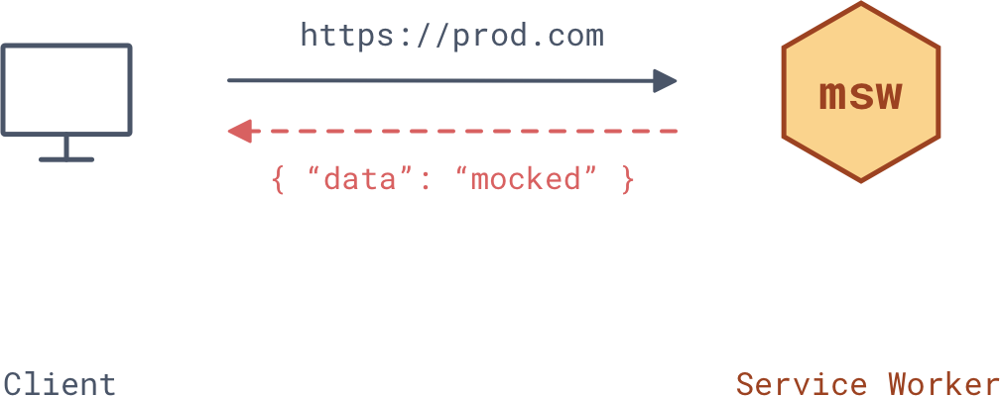
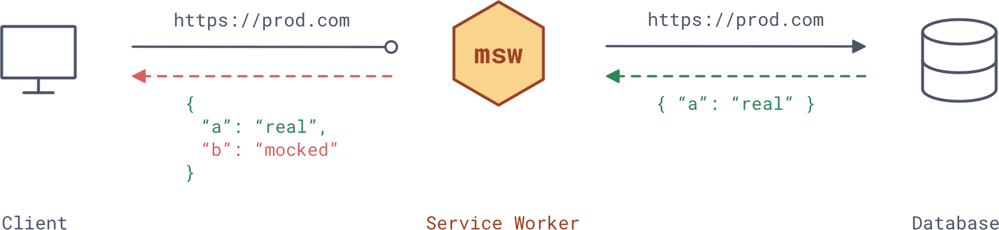

<p align="center">
  <a href="https://www.npmjs.com/package/msw" target="_blank">
    
  </a>
  <a href="https://circleci.com/gh/open-draft/msw" target="_blank">
    
  </a>
  <a href="https://david-dm.org/open-draft/msw" target="_blank">
    
  </a>
  <a href="https://david-dm.org/open-draft/msw?type=dev" target="_blank">
    
  </a>
</p>

<h1 align="center">MSW</h1>

<p align="center">MSW (<i>Mock Service Worker</i>) is an API mocking library that operates by intercepting production requests.</p>

## Features

- **Server-less**. Doesn't establish any servers, operates entirely in a browser;
- **Deviation-free**. Intercepts production URI requests from your page and mocks their responses;
- **Mocking as a tool**. Enable/disable/change mocking logic on runtime instantly without any compilations or rebuilds. Control the MSW lifecycle from your browser's DevTools;
- **Essentials**. Mock status codes, headers, delay responses, and create custom response mocking functions.

## Motivation

Conventional API mocking suffers from the following pain-points:

- Relies on a dedicated mocking server which you need to run and maintain;
- There is no actual mocking in place: instead you _replace_ requests' urls to point to the mocking server that _seemingly_ behaves as the production one;
- Brings extra dependencies to your application where it should have been a plain development tool.

MSW is immune to all of the above, as it's mocking principle doesn't revolve around servers.

## Explanation

MSW uses a [Service Worker](https://developer.mozilla.org/en-US/docs/Web/API/Service_Worker_API) with its ability to intercept requests for the purpose of caching. Only, instead of caching MSW matches a dispatched request against a mocking schema, and returns a pre-defined mocked response upon match.

<br />

<p align="center">
  
</p>

<br />

The primary benefit of using Service Workers for mocking is the ability to request the very same resources a client would in production. Since MSW performs "request-response" matching, there is no need for you to define conditional request URLs for the sake of mocking. It's enough to enable/disable the MSW to control if the mocking should happen.

> **Note:** Service Workers is a browser API, which makes MSW usable only on the client-side. You won't be able to use this mock when hitting your website via Postman, for example.

A mocking function contains information about the request, so you can _perform the actual request_ and then patch it with the mocked data, if needed.

<br />

<p align="center">
  
</p>

<br />

MSW uses conventional path definitions (like the ones in [ExpressJS](https://expressjs.com/)), making it easer to target outgoing traffic for mocking. Requests not matching any mocking definition are bypassed and performed as usual.

## Getting started

### 1. Install

```bash
npm install msw --save
```

### 2. Configure

Run the following command in your project's public directory:

```bash
node_modules/.bin/msw init <publicDir>
```

> Replace `publicDir` with the relative path to your server's public directory (i.e. `msw init ./public`).

This copies the [`mockServiceWorker.js`](./mockServiceWorker.js) file to the specified `publicDir`, so it's served as a static asset by your server. This way browser can access and register the mock service worker module.

#### Where is my "public" directory?

A public directory is usually a build directory of your application (`./build`, `./public` or `./dest`). It's the root directory served by your server. This directory is often committed to Git, so **should be the Mock Service Worker**.

> You may also generate the Mock Service Worker as a part of your build.

### 3. Define mocks

Start by creating a mocking definition file:

```js
// app/mocks.js
import { composeMocks, rest } from 'msw'

// Configure mocking routes
const { start } = composeMocks(
  rest.get(
    'https://api.github.com/repos/:owner/:repo',
    (req, res, { status, set, delay, json }) => {
      // access request's params
      const { owner, repo } = req.params

      return res(
        // set custom status
        status(200),

        // set headers
        set({ 'X-Header': 'Mocked value' }),

        // delay the response
        delay(1000),

        // send JSON response body
        json({
          name: 'mocked-name',
          owner,
          repo,
        }),
      )
    },
  ),
)

/* Start the Service Worker */
start()
```

> Modularize, abstract, reuse. The structure of mocks is up to you, but be sure **to call `start()` only once.**

### 4. Integrate

Mocking is a **development-only** procedure. It's recommended to include your mocking module (i.e. `app/mocks.js`) into your application's entry during the build. See the examples below.

#### Use webpack

```js
// ./webpack.config.js
const __DEV__ = process.env.NODE_ENV === 'development'

module.exports = {
  entry: [
    // Include mocks when in development
    __DEV__ && 'app/mocks.js',

    // Include your application's entry
    'app/index.js',
  ].filter(Boolean),

  // Rest of your config here
  ...webpackConfig,
}
```

#### Use conditional require

Alternatively, you can require mocking file(s) conditionally in your client bundle.

```js
// app/index.js
if (process.env.NODE_ENV === 'development') {
  require('./mocks.js')
}
```

## Update on reload

Service Workers are designed as a caching tool. However, we don't want our mocking definitions to be cached since that would result into out-of-date logic during development.

It's highly recommend to **enable "Update on reload"** option in your browser (DevTools > Application > Service Workers, in Chrome). This will force Service Worker to update on each page reload, ensuring the latest logic is applied.


> Read more about the [Service Worker Lifecycle](https://developers.google.com/web/fundamentals/primers/service-workers/lifecycle).

## API

### `composeMocks(...MockDef): PublicAPI`

Composes given mocking definitions into a single schema.

#### Example

```ts
import { composeMocks, rest } from 'msw'

const { start } = composeMocks(
  rest.get('https://api.github.com/users/:username', resolver),
  rest.post(/api.backend.dev/, resolver),
)
```

> Mock definitions exposed under the `rest` namespace contain high-order function convenient for mocking a REST API.

## How does it work?

MSW (_Mock Service Worker_) uses Service Worker API with its primary ability to intercept requests, but instead of caching responses it imitates them according to the provided mock definitions. Here's a simplified internal flow:

1. MSW spawns a dedicated Service Worker and creates a communication channel between the worker and the client.
1. Service Worker then signals any outgoing requests on the page to the MSW, which attempts to match them against the defined mocking routes.
1. When any match occurs, the `resolver` function is executed, and its payload is returned as the mocked response.

## Browser support

This library is meant to be used for **development only**. It doesn't require, nor encourage you to install any Service Worker on production environment.

> [**See browser support table for ServiceWorkers**](https://caniuse.com/#feat=serviceworkers)

## Contribute

Have an idea? Found a bug? Please communicate it through using the [issues](https://github.com/open-draft/msw/issues) tab of this repository. [Pull requests](https://github.com/open-draft/msw/pulls) are welcome as well!
